# 🤖 Lyzr AI - Automated GitHub PR Review Agent

> **An intelligent, multi-agent code review system powered by Lyzr Automata.**  
> It parses raw Git diffs, orchestrates specialized AI agents, and enforces strict "Security Dominance" logic to generate high-signal, noise-free reviews.

---

## 📖 Overview

This project is a backend-heavy **Automated Pull Request Reviewer** built for the Lyzr Backend Engineering Challenge.

Unlike simple wrappers that blindly feed code to an LLM, this system implements a robust **Orchestration Pipeline** designed to mimic a human engineering team. It solves common AI pitfalls like *hallucination* and *alert fatigue* through deterministic parsing and aggressive Python-based filtering.

---

## 🚀 Key Features

### 🔍 Smart Diff Parsing
A custom Regex-powered parser reads Git Hunk headers like:

```
@@ -10,5 +12,7 @@
```

It mathematically computes exact new-line indices, ensuring comments appear **precisely** on the modified lines—eliminating “AI guessed the wrong line number” issues.

### 🧠 Multi-Agent Orchestration (Lyzr Automata)
Three highly specialized review agents:

- **🛡️ Security Agent** — Detects SQL Injection, XSS, secrets, raw queries, unsafe patterns.  
- **🧠 Quality Agent** — Identifies logic bugs, code smell, maintainability issues.  
- **🏗️ Architect Agent** — Evaluates coupling, cohesion, patterns, and structural flaws.

Agents analyze ONLY the changed code hunks.

### 🔥 The "Firewall" + "Highlander" Logic  
Two fully deterministic, Python-enforced safety layers:

#### **1. Role-Enforcement Firewall**
A regex-based sanitizer that **blocks role bleeding**:  
Quality/Architect agents are prevented from mentioning Security topics like:

- “SQL Injection”
- “Credentials”
- “Unsanitized input”
- “API Key”
- “Raw query”
- “Vulnerability”

If they do, the comment is automatically deleted.

#### **2. Security Dominance + Highlander Rule**
- If the Security Agent flags a line → all other agents are silenced for that line.  
- Only **one** comment per `(file, line)` survives.  
- Severity-based ordering ensures the **most important** issue is kept.

This produces clean, de-noised, human-grade PR review output.

### ⚡ Idempotency & Cost Control  
An in-memory Commit SHA cache ensures:

- Each commit is analyzed **once**
- Prevents spam
- Reduces LLM costs

### 🔐 Production-Grade GitHub Security  
HMAC validation of:

```
X-Hub-Signature-256
```

Ensures webhook requests are truly from GitHub.

---

## ⚙️ Architecture

**Flow:**  
`GitHub Webhook` → `FastAPI` → `Diff Parser` → `Agents` → `Synthesizer` → `GitHub Review Comment`

### Diagram

```mermaid
graph TD
    A[GitHub Webhook] -->|HMAC Verified| B(FastAPI Endpoint)
    B --> C{Commit Cache}
    C -- Cached --> D[Ignore]
    C -- New SHA --> E[Diff Parser]
    E -->|Chunks| F[Agent Orchestrator]
    F --> G[🛡️ Security Agent]
    F --> H[🧠 Quality Agent]
    F --> I[🏗️ Architect Agent]
    G & H & I --> J[Synthesizer Layer]
    J -->|Firewall & Dedup| K[Markdown Report]
    K --> L[Post to GitHub]
```



---

## 🛠️ Tech Stack

- **Python 3.10+**
- **FastAPI**
- **Lyzr Automata** (Agent Orchestration)
- **LiteLLM** (Gemini 1.5/2.0)
- **PyGithub**
- **Regex-based Diff Interpreter**
- **Pydantic v2**

---

## 🚀 Setup & Installation

### 1. Clone Repo

```bash
git clone https://github.com/sachinsr11/lyzr-challenge.git
cd lyzr-challenge
```

### 2. Install Dependencies

```bash
pip install -r requirements.txt
```

### 3. Configure Environment

Create `.env`:

```env
GOOGLE_API_KEY=your_gemini_key
GITHUB_TOKEN=your_pat_token
WEBHOOK_SECRET=your_webhook_secret
LOG_LEVEL=INFO
```

### 4. Run Server

```bash
uvicorn src.main:app --reload
```

Server runs at:

```
http://0.0.0.0:8000
```

---

## 🧪 Usage

### ✅ Method A: Local Manual Testing

Endpoint: `POST /review-diff`  
Headers: `Content-Type: application/json`  

Example JSON:

```json
{
  "diff_text": "diff --git a/main.py b/main.py\nindex 83db48f..bf0329c 100644\n--- a/main.py\n+++ b/main.py\n@@ -10,4 +10,5 @@ def login(user, password):\n-    query = f\"SELECT * FROM users WHERE user='{user}'\"\n+    # Unsafe direct string formatting\n+    query = \"SELECT * FROM users WHERE user='%s'\" % user"
}
```

### ✅ Method B: GitHub Webhook (Live)

Steps:

1. `ngrok http 8000`
2. GitHub → Repo → **Settings → Webhooks**
3. Payload URL:  
   `https://<ngrok-url>/webhook`
4. Content type: `application/json`
5. Secret: same as `.env`
6. Events: **Pull Requests**

---

## 🧠 Design Decisions

### 🔹 Why build a custom diff parser?
LLMs hallucinate line numbers.  
Git Hunk headers (`@@ -10,5 +12,7 @@`) contain the math needed to compute exact positions, so we wrote our own parser.  
This gives **perfect inline review comments**.

### 🔹 Why "Security Dominance"?
Multiple agents often comment on the same risky line.  
A SQL injection could trigger:

- Security: Critical  
- Quality: High  
- Architect: Medium  

This overwhelms developers.  
Our Highlander Logic collapses all into **one Security issue**.

### 🔹 Why a Firewall?
LLMs often "wander" between domains.  
Security terminology leaking into Quality is the most common cause of false positives.  
Regex-firewalling eliminates this class of errors.
